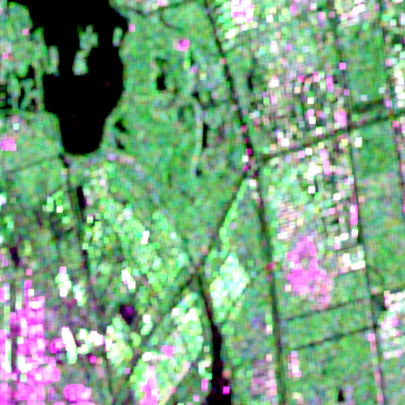
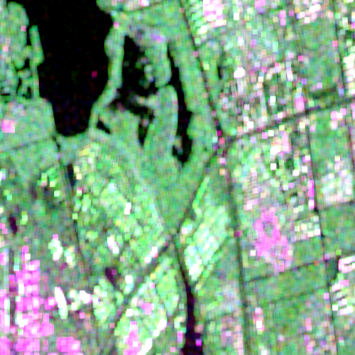
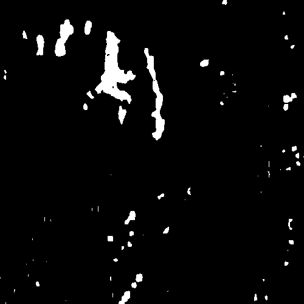

# A simple library for unsupervised Polarimetric SAR change detection

## Introduction
this is a simple library for unsupervised Polarimetric SAR change detection. the main function is the **unsupervised_CD** function in unsupervised_CD.py

## Example
edit in the "if __name__ == '__main__'" part of unsupervised_change_detection.py like below

        if __name__ == '__main__'
            fa = r'path/to/C3/folder_A'
            fb = r'path/to/C3/folder_B'
            gt = r'path/to/groundtruth/file'
            save_path = r'path/to/save/result/images'
            
            confusion_matrix = unsupervised_CD(fa, fb, save_path, gt,
                                is_print=True, distance_type='Bartlett')

            print(f'confusion_matrix:\n{confusion_matrix}')

The change detection result will be like that below:
<!-- 
 -->
<!--  -->
|  |  |  |
| :-------------------------: | :---------------------------: | :-------: |
|time A | time B | change detection result |
<!-- 
 -->

## Requirements
This repo need [my another library](https://github.com/yoyoyoohh/mylib)

## License
This project is released under the [Apache 2.0 license](LICENSE).